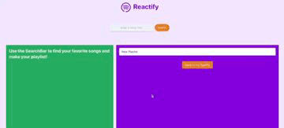

# React Spotify Playlist Creator

This is a React app that uses [Tailwind CSS](https://tailwindcss.com/) and [Spotify API](https://developer.spotify.com/documentation/web-api/) to create custom playlists. You can enter the site with your Spotify account and browse through different genres, moods, and artists. You can also search for songs and add them to your playlist. Once you are done, you can save your playlist to your Spotify account and enjoy your music.



## Features

- Responsive design with Tailwind CSS
- Authentication with Spotify API
- Fetching data from Spotify API
- Creating and editing playlists
- Saving playlists to Spotify account

## How to run

1. Clone this repository
2. Install the dependencies with `npm install`
3. Create a `.env` file in the root directory and add your Spotify client ID and redirect URI as follows:
```
REACT_APP_SPOTIFY_CLIENT_ID=your_client_id REACT_APP_SPOTIFY_REDIRECT_URI=your_redirect_uri
```
4. Start the development server with `npm start`
5. Open `http://localhost:3000` in your browser

## Demo

You can see a live demo of the app here: https://mcfadem.netlify.app

## License

This project is licensed under the MIT License - see the [LICENSE](LICENSE) file for details.